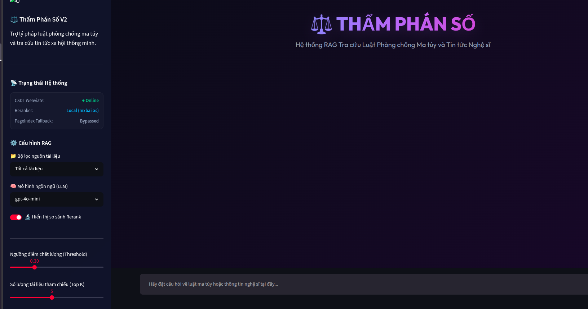
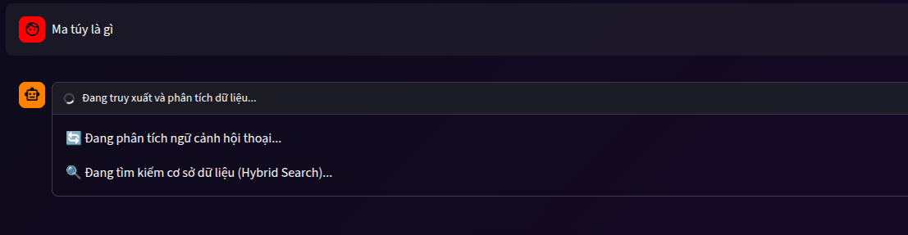
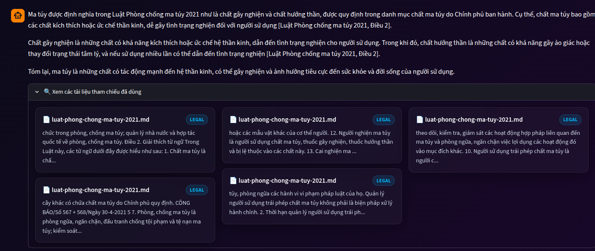

# Ngày 8 — RAG Pipeline v2

**Chương 2 | Ngày 8 trong 15**

---

## Phân công task

| Member          | Tasks                    |
| ------------------ | ----------------------------- |
| Lê Thanh Minh-2A202600872     | setup backend + deploy                   |
| Đỗ Minh Phúc - 2A202600585  | Custom Prompt + Evaluation |
| Thanh Điệp - 2A202600636  | Evaluation |
| Nguyễn Văn Minh - 2A202600904  | Dataset + report |
| Phí Đình Mạnh - 2A202600826  | report |


## Mục Tiêu

Xây dựng một RAG pipeline thực tế, end-to-end, từ thu thập dữ liệu pháp luật và báo chí về ma tuý → xử lý → indexing → retrieval (hybrid + vectorless fallback) → generation có citation.

---

## Chủ Đề Dữ Liệu

**Pháp luật Việt Nam về ma tuý và các chất cấm** + **Các bài báo về nghệ sĩ liên quan tới ma tuý**

---

## Cấu Trúc Thư Mục

```
day_08_rag_pipeline_v2/
├── README.md
├── data/
│   ├── landing/          ← Task 1 & 2: raw files (PDF, DOCX, HTML)
│   └── standardized/     ← Task 3: converted markdown files
├── src/
│   ├── __init__.py
│   ├── task1_collect_legal_docs.py
│   ├── task2_crawl_news.py
│   ├── task3_convert_markdown.py
│   ├── task4_chunking_indexing.py
│   ├── task5_semantic_search.py
│   ├── task6_lexical_search.py
│   ├── task7_reranking.py
│   ├── task8_pageindex_vectorless.py
│   ├── task9_retrieval_pipeline.py
│   └── task10_generation.py
├── notebooks/
│   └── demo.ipynb         ← Notebook demo cho buổi trình bày
├── group_project/
│   └── README.md          ← Hướng dẫn bài tập nhóm
├── requirements.txt
└── .env.example
```

## 1. Project Overview

### Problem Statement

Xây dựng hệ thống Retrieval-Augmented Generation (RAG) hỗ trợ tra cứu:

* Văn bản pháp luật Việt Nam liên quan đến ma túy
* Nghị định hướng dẫn thi hành
* Bộ luật Hình sự
* Tin tức báo chí về các vụ án ma túy và người nổi tiếng

Mục tiêu là cung cấp câu trả lời có dẫn nguồn (citation), giảm hallucination và cho phép đánh giá định lượng chất lượng retrieval/generation.

---

## 3. System Architecture

### High-Level Architecture

```text
User Query
    │
    ▼
Hybrid Retrieval
(Dense + BM25)
    │
    ▼
RRF Fusion
    │
    ▼
Cross Encoder Reranker
    │
    ▼
Context Reordering
    │
    ▼
GPT-4o-mini
    │
    ▼
Answer + Citation
```

---

## 4. Technology Stack

### Data Processing

| Component        | Technology                                                  |
| ---------------- | ----------------------------------------------------------- |
| Crawling         | Crawl4AI                                                    |
| PDF/DOCX Parsing | MarkItDown                                                  |
| Chunking         | MarkdownHeaderTextSplitter + RecursiveCharacterTextSplitter |

### Retrieval

| Component        | Technology                           |
| ---------------- | ------------------------------------ |
| Embedding Model  | text-embedding-3-small               |
| Vector Database  | Weaviate Cloud                       |
| Dense Retrieval  | near_vector                          |
| Sparse Retrieval | BM25                                 |
| Fusion           | Reciprocal Rank Fusion (RRF)         |
| Reranker         | mixedbread-ai/mxbai-rerank-xsmall-v1 |

### Generation

| Component          | Technology                    |
| ------------------ | ----------------------------- |
| LLM                | GPT-4o-mini                   |
| Citation           | Custom Prompt                 |
| Context Reordering | Lost-in-the-middle mitigation |

### Evaluation

| Component | Technology  |
| --------- | ----------- |
| Framework | DeepEval    |
| Judge LLM | GPT-4o-mini |

---

## 6. Streamlit Chatbot

### Features

* Chat UI
* Retrieval + Generation
* Citation
* Source Viewer

### Demo Screenshot



### Chat Flow

```text
User
 ↓
Hybrid Search
 ↓
Rerank
 ↓
GPT-4o-mini
 ↓
Answer + Sources
```




---

## 7. Evaluation

### Evaluation Framework

Framework:

```text
DeepEval
```

Judge Model:

```text
GPT-4o-mini
```

Metrics:

* Faithfulness
* Answer Relevance
* Context Recall
* Context Precision

---

## 8. Golden Dataset

Tạo bộ kiểm thử gồm:

```text
15 câu hỏi
```

bao phủ:

### Legal Knowledge

Ví dụ:

```text
Theo Luật Phòng chống ma túy, chất ma túy được định nghĩa như thế nào?
```

```text
Người nghiện ma túy được hiểu như thế nào?
```

```text
Tội sản xuất trái phép chất ma túy theo Điều 248 có mức hình phạt cao nhất là gì?
```

### News Knowledge

Ví dụ:

```text
Đường dây ma túy liên quan đến Chi Dân bắt nguồn từ vụ án nào?
```

```text
Ca sĩ Miu Lê bị phát hiện sử dụng ma túy ở đâu?
```

### Dataset Format

```json
{
  "question": "...",
  "expected_answer": "...",
  "expected_context": [
    "..."
  ]
}
```

---

## 9. Evaluation Results

### Overall Scores

| Metric       | Config A | Config B |
| ------------ | -------- | -------- |
| Faithfulness | 0.91     | 0.82     |
| Relevance    | 0.815    | 0.765    |
| Recall       | 0.79     | 0.70     |
| Precision    | 0.77     | 0.69     |

### Comparison

#### Config A

```text
Hybrid Search
+
Cross Encoder Reranking
```

#### Config B

```text
Hybrid Search
No Reranking
```

### Key Finding

Config A cải thiện:

* Faithfulness +0.09
* Recall +0.09
* Precision +0.08

Cross Encoder giúp giảm nhiễu retrieval và cải thiện grounding.

---

## 10. Failure Analysis

### Worst Cases

| Question     | Root Cause     |
| ------------ | -------------- |
| Điều 248     | Retrieval miss |
| Andrea Aybar | Retrieval miss |
| Miu Lê       | Retrieval miss |

### Root Causes

* Thiếu chunk liên quan
* Embedding không đủ gần
* Query sử dụng từ khóa hiếm

---

## 11. Future Improvements

### Retrieval

* Increase top_k
* Better score threshold
* Query expansion

### Data

* Thêm nhiều nghị định và thông tư
* Bổ sung dữ liệu báo chí

### Generation

* Tăng tính nghiêm ngặt của citation prompt
* Structured answer format

### Next Phase

Knowledge Graph RAG:

```text
Vector Search
      +
Knowledge Graph
      +
LLM
```

để xử lý các câu hỏi suy luận nhiều bước và truy vấn liên kết thực thể.

---

## 12. How to Run

### Install

```bash
uv sync
```

### Environment

```bash
cp .env.example .env
```

Điền:

```env
OPENAI_API_KEY=
WEAVIATE_URL=
WEAVIATE_API_KEY=
```

### Run Chatbot

```bash
streamlit run app.py
```

### Run Evaluation

```bash
uv run group_project/evaluation/eval_pipeline.py
```

---

## 13. Repository Structure

```text
.
├── data/
├── src/
├── notebooks/
├── group_project/
│   └── evaluation/
│       ├── golden_dataset.json
│       ├── eval_pipeline.py
│       └── results.md
├── app.py
├── README.md
└── requirements.txt
```

---

Phần quan trọng nhất là **mục 3, 6, 8, 9** vì giảng viên hoặc reviewer thường chỉ xem:

1. Kiến trúc hệ thống.
2. Ảnh chatbot demo.
3. Bộ test gồm những câu hỏi gì.
4. Kết quả đánh giá và phân tích A/B.
